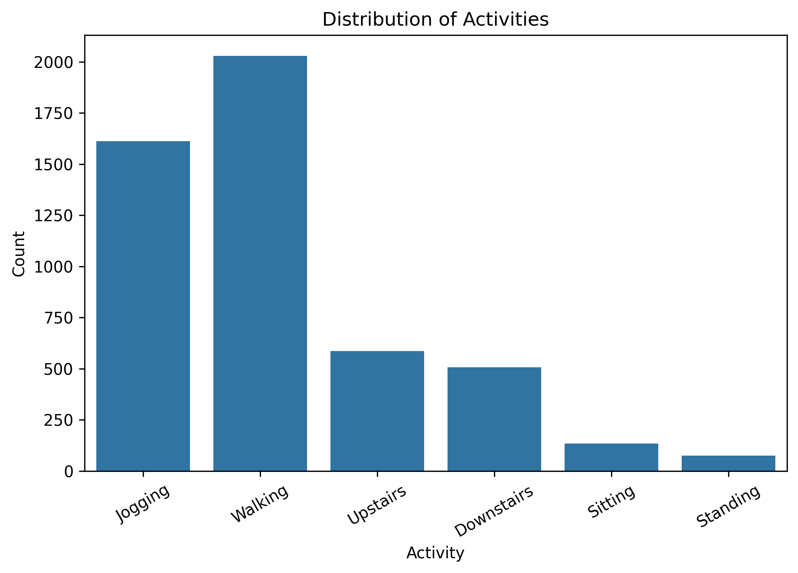
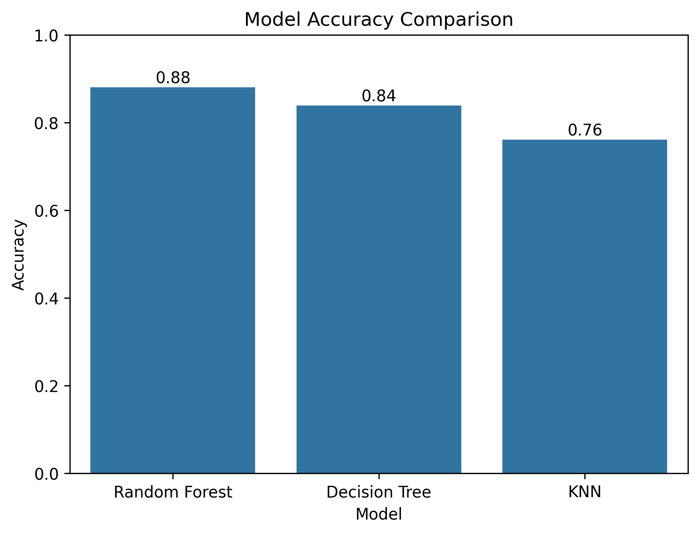
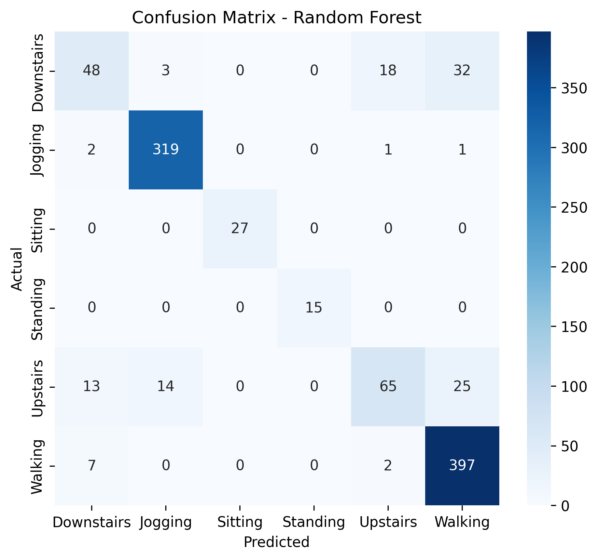
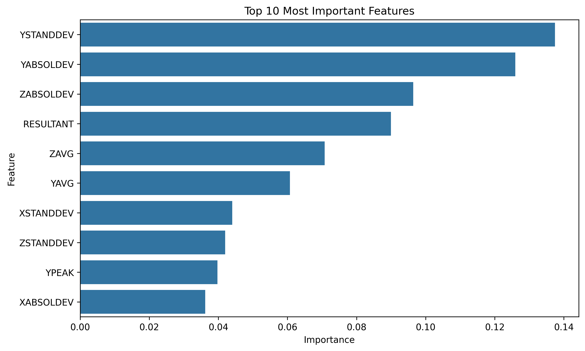

# Human Activity Recognition using Machine Learning

## Overview

This project implements a Human Activity Recognition (HAR) system using the official WISDM Activity Recognition dataset. Three machine learning algorithms are trained and evaluated to classify six human activities using smartphone sensor-derived features.

## Activities Classified

- Walking
- Jogging
- Upstairs
- Downstairs
- Sitting
- Standing

---

## Machine Learning Models

- Decision Tree
- K-Nearest Neighbors (KNN)
- Random Forest

---

## Results

| Model | Accuracy |
|--------|----------|
| Random Forest | **88.07%** |
| Decision Tree | 83.92% |
| KNN | 76.14% |

Random Forest achieved the highest performance and was selected as the final model.

---

## Technologies Used

- Python
- Pandas
- NumPy
- Scikit-learn
- Matplotlib
- Seaborn
- Jupyter Notebook

---

## Dataset

Official WISDM Activity Recognition Dataset

---

## Project Workflow

1. Load Dataset
2. Data Preprocessing
3. Exploratory Data Analysis
4. Feature Scaling
5. Model Training
6. Model Evaluation
7. Activity Prediction

---

## Results

---

## Future Improvements

- Deep Learning models (CNN/LSTM)
- Real-time smartphone activity prediction
- Streamlit web application

---

## Author

Anshol Prasad